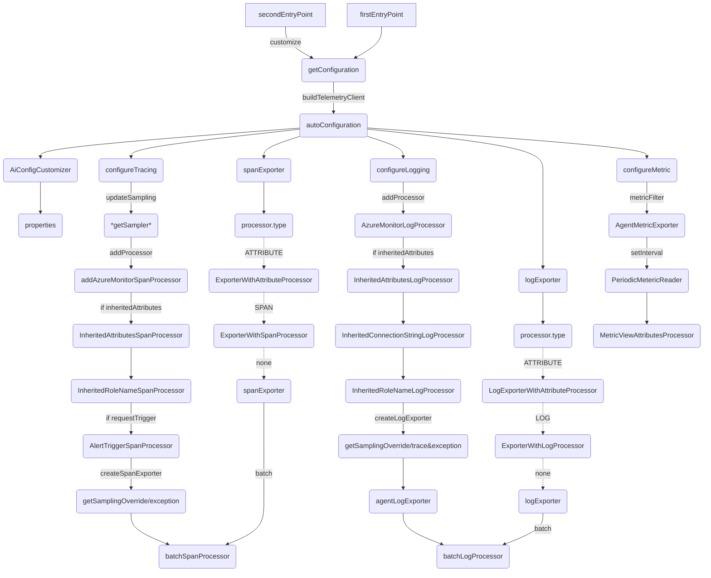

```mermaid
graph TD
A[secondEntryPoint]-->|customize|B(getConfiguration)
AA[firstEntryPoint]-->B
B-->|buildTelemetryClient|D(autoConfiguration)
D-->DD(AiConfigCustomizer)
DD-->DDD(properties)
D-->D1(spanExporter)
D-->D2(configureTracing)
D-->D3(logExporter)
D-->D4(configureLogging)
D-->D5(configureMetric)

D1-->E(processor.type)
E-.->|ATTRIBUTE|E1(ExporterWithAttributeProcessor)
E1-.->|SPAN|E2(ExporterWithSpanProcessor)
E2-.->|none|E3(spanExporter)

D2-->|updateSampling|F(*getSampler*)
F-->|addProcessor|F1(addAzureMonitorSpanProcessor)
F1-->|if inheritedAttributes|F2(InheritedAttributesSpanProcessor)
F2-->F4(InheritedRoleNameSpanProcessor)
F4-->|if requestTrigger|F5(AlertTriggerSpanProcessor)
F5-->|createSpanExporter|F6(getSamplingOverride/exception)
F6-->F7(batchSpanProcessor)
E3---->|batch|F7

D3-->G(processor.type)
G-.->|ATTRIBUTE|G1(LogExporterWithAttributeProcessor)
G1-.->|LOG|G2(ExporterWithLogProcessor)
G2-.->|none|G3(logExporter)

D4-->|addProcessor|H(AzureMonitorLogProcessor)
H-->|if inheritedAttributes|H1(InheritedAttributesLogProcessor)
H1-->H2(InheritedConnectionStringLogProcessor)
H2-->H3(InheritedRoleNameLogProcessor)
H3-->|createLogExporter|H4(getSamplingOverride/trace&exception)
H4-->H5(agentLogExporter)
H5-->H6(batchLogProcessor)
G3-->|batch|H6

D5-->|metricFilter|I(AgentMetricExporter)
I-->|setInterval|I1(PeriodicMetericReader)
I1-->I2(MetricViewAttributesProcessor)
``` 
