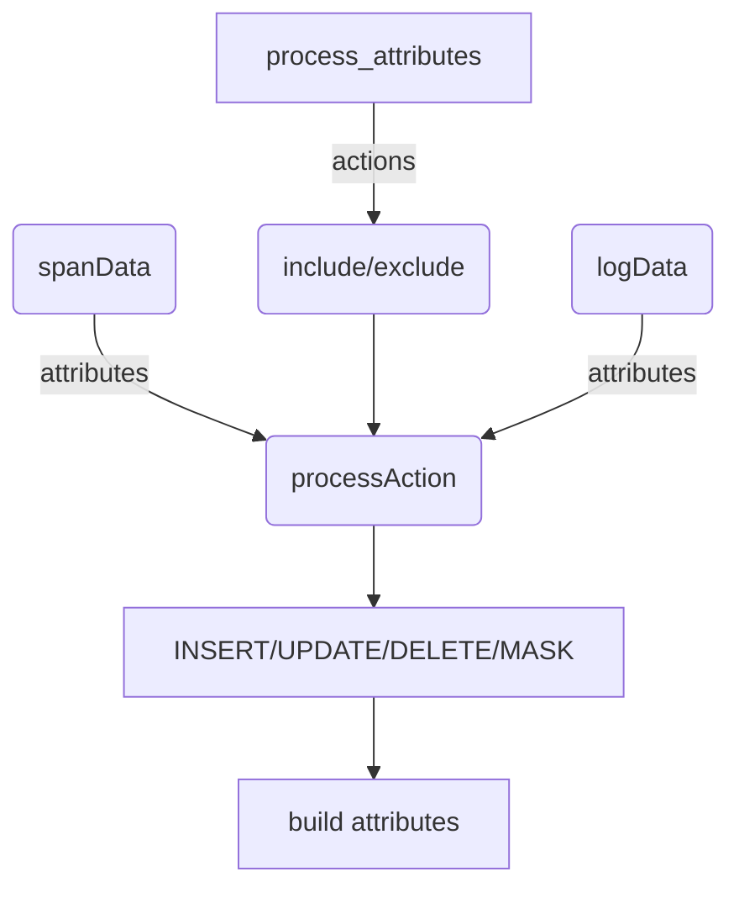

```mermaid
graph TD
O1(spanData) --> |attributes|C
A[process_attributes] --> |actions|B(include/exclude)
B --> C(processAction)
O2(logData) --> |attributes|C
C --> D[INSERT/UPDATE/DELETE/MASK]
D --> E[build attributes]
```
