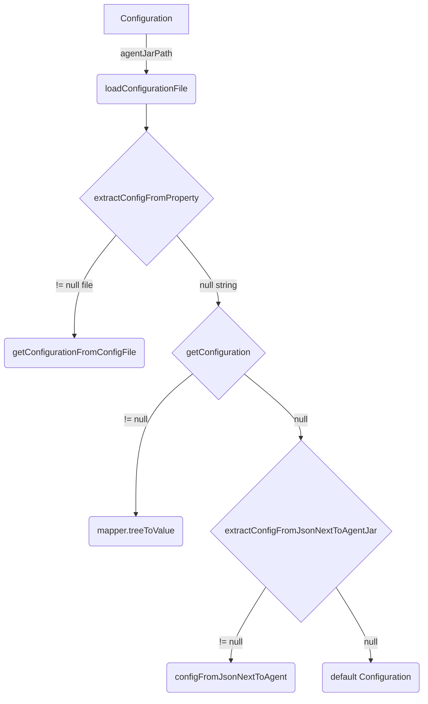

```mermaid
graph TD
A[Configuration] -->|agentJarPath| B(loadConfigurationFile)
B --> C{extractConfigFromProperty}
C -->|!= null file|D(getConfigurationFromConfigFile)
C -->|null string|E{getConfiguration}
E -->|!= null|F(mapper.treeToValue)
E -->|null|G{extractConfigFromJsonNextToAgentJar}
G -->|!= null|H(configFromJsonNextToAgent)
G -->|null|I(default Configuration)

```
