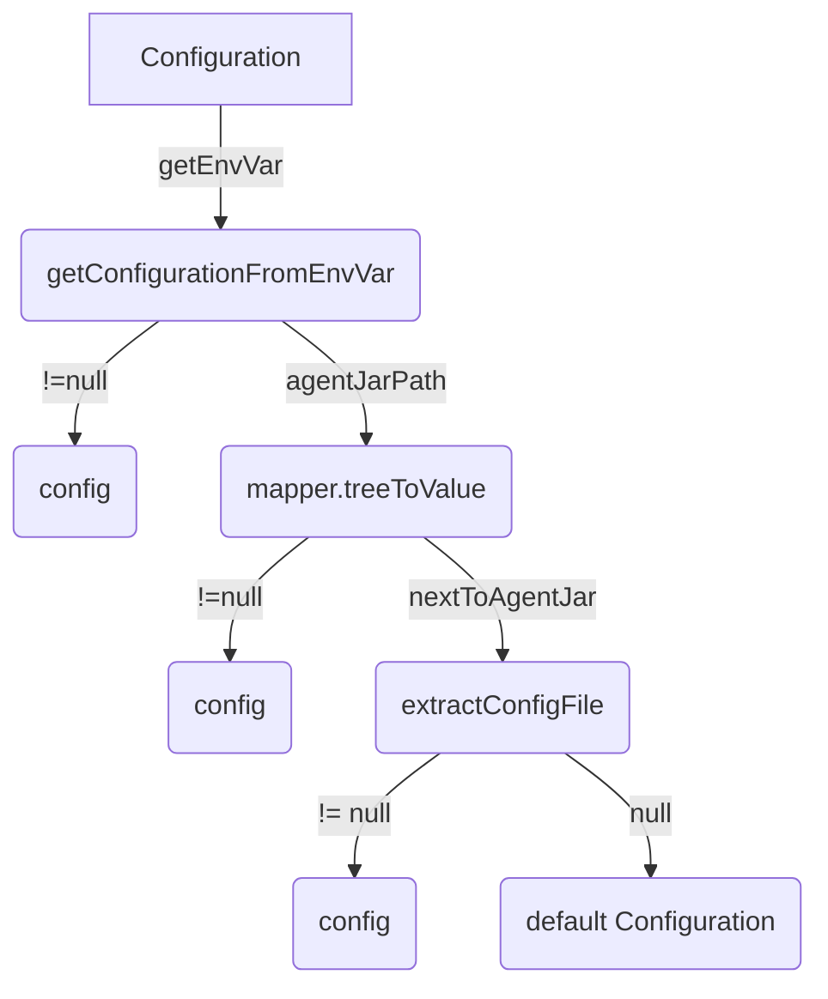

```mermaid
graph TD
A[Configuration] -->|getEnvVar|B1(getConfigurationFromEnvVar)
B1 -->|!=null|B2(config)
B1 --> |agentJarPath|C(mapper.treeToValue)
C --> |!=null|C1(config)
C -->|nextToAgentJar|G(extractConfigFile)
G -->|!= null|H(config)
G -->|null|I(default Configuration)

```
