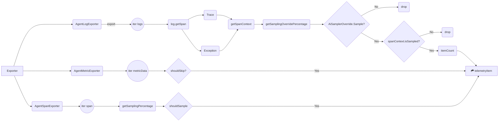

```mermaid
graph LR
A[Exporter] --> A1(AgentLogExporter)
A --> A2(AgentMetricExporter)
A --> A3(AgentSpanExporter)

A1 --> |export|B((iter logs))
B --> B1(log.getSpan)
B1 --> B2(Trace)
B1 --> B3(Exception)
B2 --> B4(getSpanContext)
B3 --> B4
B4 --> B5(getSamplingOverridePercentage)
B5 --> B6{AiSamplerOverride.Sample?}
B6 -->|No|B7(drop)
B6 -->|Yes|B8{spanContext.isSampled?}
B8 -->|No|B9(drop)
B8 -->|Yes|B10(itemCount)

B10 --> Z[fa:fa-share  telemetryItem]

A2 -->C((iter metricData))
C -->C1{shouldSkip?}
C1 -------->|Yes|Z

A3 -->C3((iter span))
C3 -->C4(getSamplingPercentage)
C4 -->C5{shouldSample}
C5 -------->|Yes|Z

```
