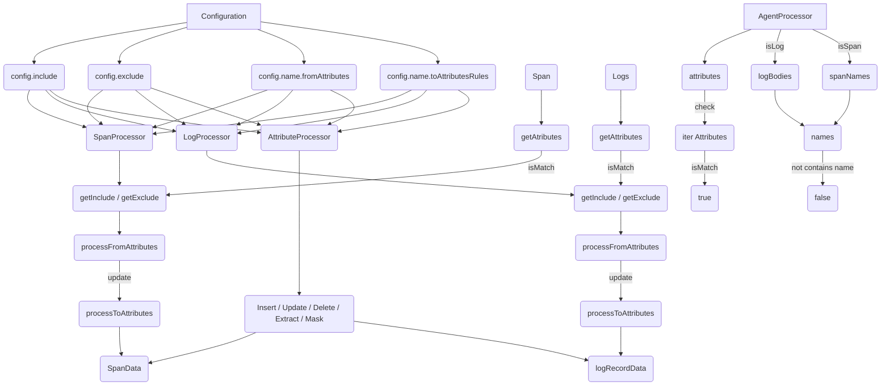

```mermaid
graph TD
A[Configuration] --> A1(config.include)
A --> A2(config.exclude)
A --> A3(config.name.fromAttributes)
A --> A4(config.name.toAttributesRules)

A1 --> B(SpanProcessor)
A2 --> B
A3 --> B
A4 --> B

A1 --> C(LogProcessor)
A2 --> C
A3 --> C
A4 --> C

B --> B1(getInclude / getExclude)
D(Span) --> D1(getAtributes)
D1 --> |isMatch|B1
B1 --> D2(processFromAttributes)
D2 --> |update|D3(processToAttributes)
D3 --> D4(SpanData)

E(Logs) --> E1(getAttributes)
E1 -->|isMatch|E2(getInclude / getExclude)
C --> E2
E2 -->E3(processFromAttributes)
E3 -->|update|E4(processToAttributes)
E4 -->E5(logRecordData)

A1 --> F(AttributeProcessor)
A2 --> F
A3 --> F
A4 --> F

F --> F1(Insert / Update / Delete / Extract / Mask)
F1 --> D4
F1 --> E5

H[AgentProcessor] --> I(attributes)
H --> |isLog|H2(logBodies)
H --> |isSpan|H3(spanNames)
H2 --> H4(names)
H3 --> H4
H4 --> |not contains name|H5(false)
I --> |check|I1(iter Attributes)
I1 --> |isMatch|I2(true)

```
