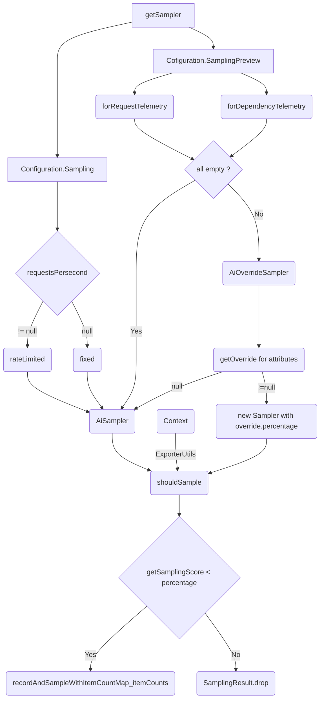

```mermaid
graph TD
O[getSampler] --> A[Configuration.Sampling]
O[getSampler] --> B[Cofiguration.SamplingPreview]

A --> C{requestsPersecond}
C --> |!= null|D(rateLimited)
D --> E(AiSampler)
C --> |null| F(fixed)
F --> E(AiSampler)

B --> G(forRequestTelemetry)
B --> H(forDependencyTelemetry)
G --> I{all empty ?}
H --> I
I --> |No|J(AiOverrideSampler)
I --> |Yes|E

E --> K(shouldSample)
L(Context) --> |ExporterUtils|K
K --> M{getSamplingScore < percentage}
M --> |Yes| N(recordAndSampleWithItemCountMap_itemCounts)
M --> |No| P(SamplingResult.drop)

J --> Q(getOverride for attributes)
Q --> |null|E
Q --> |!=null| R(new Sampler with override.percentage)
R --> K

```
