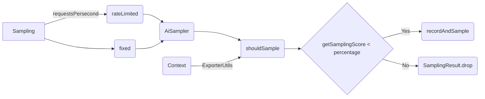

```mermaid
graph LR

A[Sampling] --> |requestsPersecond|D(rateLimited)
D --> E(AiSampler)
A --> F(fixed)
F --> E(AiSampler)

E --> K(shouldSample)
L(Context) --> |ExporterUtils|K
K --> M{getSamplingScore < percentage}
M --> |Yes| N(recordAndSample)
M --> |No| P(SamplingResult.drop)


```
