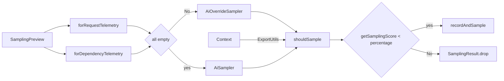

```mermaid
graph LR

A1[SamplingPreview] --> B1[forRequestTelemetry]
A1 --> B2[forDependencyTelemetry]
B1 --> C1{all empty}
B2 --> C1
C1 --> |yes|D1[AiSampler]
C1 --> |No|E1[AiOverrideSampler]
E1 --> F1[shouldSample]
AA[Context] --> |ExportUtils|F1
D1 --> F1
F1 --> G1{getSamplingScore < percentage}
G1 --> |yes|H1[recordAndSample]
G1 --> |No|H2[SamplingResult.drop]
```
