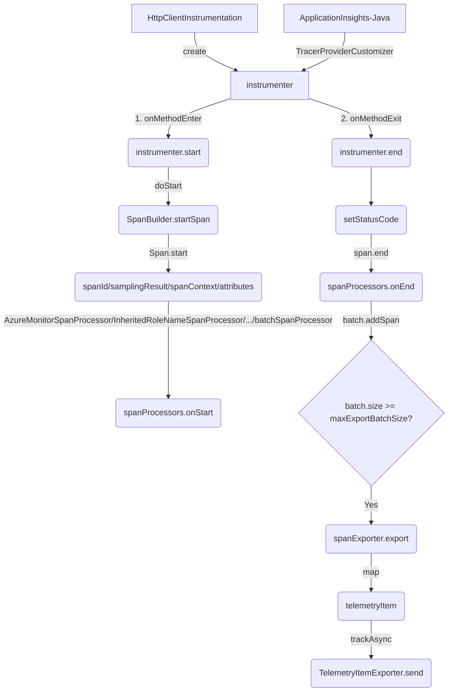

```mermaid
graph TD
A1[HttpClientInstrumentation] --> |create|B[instrumenter]
A2[ApplicationInsights-Java] --> |TracerProviderCustomizer|B
B --> |1. onMethodEnter|C1(instrumenter.start)
B --> |2. onMethodExit|C2(instrumenter.end)
C1 -->|doStart|D1(SpanBuilder.startSpan)
D1 --> |Span.start|E1(spanId/samplingResult/spanContext/attributes)
E1 --> |AzureMonitorSpanProcessor/InheritedRoleNameSpanProcessor/.../batchSpanProcessor|F1(spanProcessors.onStart)
C2 --> D2(setStatusCode)
D2 --> |span.end|E2(spanProcessors.onEnd)
E2 --> |batch.addSpan|F2{batch.size >= maxExportBatchSize?}
F2 --> |Yes|G2(spanExporter.export)
G2 --> |map|H2(telemetryItem)
H2 --> |trackAsync|I2(TelemetryItemExporter.send)
```
