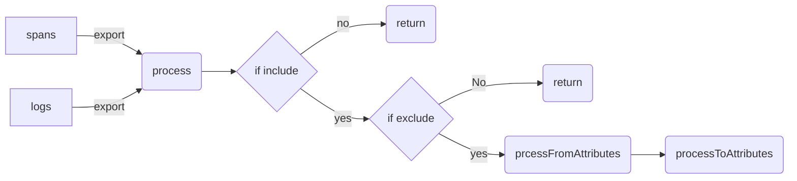

```mermaid
graph LR
A[spans] -->|export|B(process)
C[logs] -->|export|B
B -->D{if include}
D -->|no|E(return )
D -->|yes|F{if exclude}
F -->|No|G(return)
F -->|yes|H(prcessFromAttributes)
H -->I(processToAttributes)
```
