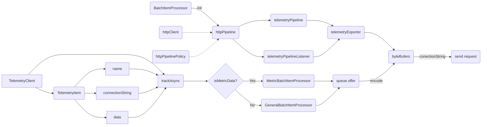

```mermaid
graph LR
A[TelemetryClient] --> B(TelemetryItem)
B --> B1[name]
B --> B2[connectionString]
B --> B3[data]

A --> C(trackAsync)
B1 --> C
B2 --> C
B3 --> C

C --> D{isMetricData?}
D --> |Yes|E(MetricBatchItemProcessor)
D --> |No|F(GeneralBatchItemProcessor)

E --> G(queue.offer)
F --> G

H(BatchItemProcessor) --> |init|I(httpPipeline)
I --> I1(telemetryPipeline)
I --> I2(telemetryPipelineListener)
I1 --> I3(telemetryExporter)
I2 --> I3
I3 --> J(byteBufers)
G --> |encode|J
J --> |conectionString|J1(send request)

K1(httpClient) -.-> I
K2(httpPipelinePolicy) -.-> I


```
